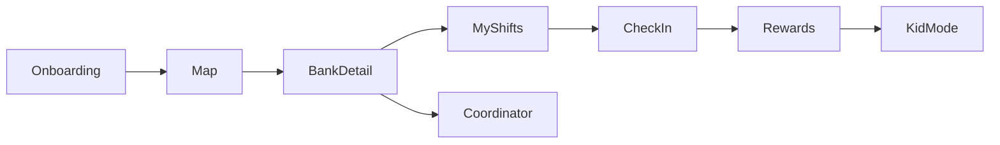

# Bushel Incremental Build Plan

## Product and constraints

Bushel is a family-friendly food bank volunteering app: discover nearby banks on a live map, view calendars/shifts, sign up, QR check-in at stations, coordinator dashboard, gamification, and Kid Mode. Target: five-minute onboarding, better child retention.

- **Repository root:** `bushel/super-giggle/`. It is the existing git repository; do not create another nested project or run `git init` inside it.
- **Code lives directly in the repository**, with the Flutter entry point at `lib/main.dart` and this plan at `docs/plan.md`.
- **v1 data:** in-memory / local mock models. No Firebase, no auth backend.
- **Later (out of scope now):** Firebase (auth, live map/shifts, realtime coordinator updates) and a free AI onboarding assistant.

## Seven-screen ecosystem

1. **Onboarding** — name + volunteer vs coordinator + family/kid toggle. Goal: under five minutes, no account server.
2. **Map / Discover** — nearby food banks from mock lat/lng (list first, then a simple map).
3. **Food bank + calendar** — hours, stations, upcoming shifts with capacity.
4. **My Shifts** — sign up / cancel locally; show upcoming commitments.
5. **QR Check-in** — scan or tap a station QR to check in and award points.
6. **Rewards** — points, badges, family challenges, leaderboard (all mock).
7. **Kid Mode** or **Coordinator Dashboard** — role-based seventh screen:
   - Kid: large tap targets, stickers, simple “next shift / check in / badge” loop.
   - Coordinator: today’s volunteers, station tasks, progress (mock, local assign).

A role switcher on the profile/onboarding flow unlocks the coordinator view without a backend.

## Repo and project setup (first implementation slice)

When you approve this plan, the first build step is **only** setup + the smallest useful screen:

1. Verify that the existing `bushel/super-giggle/` git root contains a valid Flutter scaffold. If Flutter platform files are missing, generate them in place from the repository root; do not create another `bushel/` or `super-giggle/` directory.
2. Rename app title/theme to Bushel (warm green, family-friendly Material 3).
3. Add a short `README.md` at the git root describing mock-first + future Firebase/AI.
4. Keep the repository's existing Git history and remote configuration. Do not run `git init`, replace the remote, or push unless explicitly asked.
5. Replace the default counter with **Discover: a list of 3–5 mock food banks** (name, distance, next shift). That is Feature 1.

Suggested layout after setup:

- `lib/main.dart` — `MaterialApp`, theme, home
- `lib/models/` — `FoodBank`, `Shift`, `Volunteer` (added as features need them)
- `lib/data/mock_food_banks.dart` — static sample data
- `lib/screens/` — one screen file per feature

## Incremental feature order

Follow your loop for **each** row: plan → prompt → test → fix → commit.

| Slice | Smallest useful feature | Done when |
| --- | --- | --- |
| 0 | Existing Flutter scaffold + Bushel theme | App runs from the `super-giggle` git root |
| 1 | Mock food bank list (Discover) | 3–5 banks with name, area, next opening |
| 2 | Food bank detail + mock calendar | Tap a bank → shifts with time, station, spots |
| 3 | Sign up / cancel a shift (local state) | My Shifts shows signed-up items |
| 4 | Simple map of mock banks | Pins or placeholders; tap → detail |
| 5 | Onboarding + role (volunteer / coordinator / kid) | Choice persists in memory for the session |
| 6 | QR check-in (camera or “simulate scan”) | Check-in marks shift done + adds points |
| 7 | Rewards: points + 3 badges | Profile shows total and earned badges |
| 8 | Kid Mode shell | Simplified home: next shift, check-in, sticker |
| 9 | Coordinator dashboard | Assign a mock task; see progress update |
| 10 | Family challenge + leaderboard | One challenge + ranked mock families |

**Explicitly later:** Firebase sync, real maps API keys at scale, real QR station IDs, push notifications, AI assistant.

## Build pattern (every feature)

1. Pick the next slice above (one screen or one verb).
2. Prompt Cursor with that slice only.
3. Run the app and tap through the new path.
4. Fix bugs.
5. Commit from the `super-giggle` repository root with a short why-focused message.
6. Stop. Do not start the next slice in the same change.

## First prompt after this plan is approved

Implement Slice 0 + Slice 1 only in the existing `bushel/super-giggle/` git root: verify the Flutter scaffold, add the Bushel theme, and build the mock food bank list. Preserve the existing Git repository and remote. Do not build map, QR, Kid Mode, or Firebase yet.
