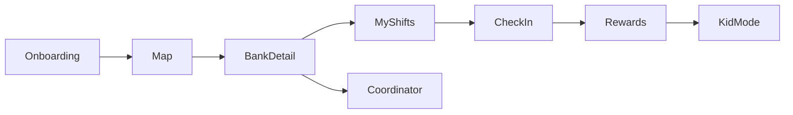

# Bushel Incremental Build Plan

## Product and constraints

Bushel is a family-friendly food bank volunteering app: discover nearby banks on a live map, view calendars/shifts, sign up, QR check-in at stations, coordinator dashboard, gamification, and Kid Mode. Target: five-minute onboarding, better child retention.

- **Repository root:** `bushel/super-giggle/`. It is the existing git repository; do not create another nested project or run `git init` inside it.
- **Code lives directly in the repository**, with the Flutter entry point at `lib/main.dart` and this plan at `plan.md`.
- **Completed mock phase (slices 0-11):** in-memory / local mock models. No Firebase or auth backend implemented yet.
- **Next phase (planned only):** Firebase setup, Email/Password Authentication, then incremental Firestore migrations. This plan update does not authorize implementation, package installation, or cloud configuration.
- **Later (out of scope for the Firebase phase):** real QR hardware/camera scanning, push notifications, and a free AI onboarding assistant.

## Seven-screen ecosystem

1. **Onboarding** — name + volunteer vs coordinator + family/kid toggle. Goal: under five minutes, no account server.
2. **Map / Discover** — nearby food banks from mock lat/lng (list first, then a simple map).
3. **Food bank + calendar** — hours, stations, upcoming shifts with capacity.
4. **My Shifts** — sign up / cancel locally; show upcoming commitments.
5. **QR Check-in** — scan or tap a station QR to check in and award points.
6. **Rewards** — points, badges, family challenges, leaderboard (all mock).
7. **Kid Mode** or **Coordinator Dashboard** — role-based seventh screen:
   - Kid: large tap targets, stickers, simple “next shift / check in / badge” loop.
   - Coordinator: today’s volunteers, station tasks, progress (mock, local assign).

A role switcher on the profile/onboarding flow unlocks the coordinator view without a backend.

## Repo and project setup (first implementation slice)

When you approve this plan, the first build step is **only** setup + the smallest useful screen:

1. Verify that the existing `bushel/super-giggle/` git root contains a valid Flutter scaffold. If Flutter platform files are missing, generate them in place from the repository root; do not create another `bushel/` or `super-giggle/` directory.
2. Rename app title/theme to Bushel (warm green, family-friendly Material 3).
3. Add a short `README.md` at the git root describing mock-first + future Firebase/AI.
4. Keep the repository's existing Git history and remote configuration. Do not run `git init`, replace the remote, or push unless explicitly asked.
5. Replace the default counter with **Discover: a list of 3–5 mock food banks** (name, distance, next shift). That is Feature 1.

Suggested layout after setup:

- `lib/main.dart` — `MaterialApp`, theme, home
- `lib/models/` — `FoodBank`, `Shift`, `Volunteer` (added as features need them)
- `lib/data/mock_food_banks.dart` — static sample data
- `lib/screens/` — one screen file per feature

## Incremental feature order

Follow your loop for **each** row: plan → prompt → test → fix → commit.

| Slice | Smallest useful feature | Done when |
| --- | --- | --- |
| 0 | Existing Flutter scaffold + Bushel theme | Complete: app runs from the `super-giggle` git root |
| 1 | Mock food bank list (Discover) | Complete: 3–5 banks with name, area, next opening |
| 2 | Food bank detail + mock calendar | Complete: tap a bank → shifts with time, station, spots |
| 3 | Add shifts and sign up locally | Complete: confirmed shifts appear on the My Shifts page |
| 4 | Simple map of mock banks | Complete: mock pins open bank previews and details |
| 5 | Onboarding + role (volunteer / coordinator / kid) | Complete: choice persists in memory for the session; Slice 10 limits signup to adults and makes Kid Mode parent-managed |
| 6 | QR check-in (simulate scan) | Complete: check-in marks shift done and adds 100 points |
| 7 | Rewards: points + 3 badges | Complete: progress and earned badges reflect check-in points |
| 8 | Kid Mode | Complete: simplified home/check-in, profile role switcher, and 25 selectable badges |
| 9 | Shift-based group management | Complete: each shift creates a group for its signed-up accounts; coordinators browse Groups and create shifts, volunteers/kids open groups from My Shifts, removal needs a two-thirds vote, and removed members lose the shift |
| 10 | Family Center + parent-managed Kid Mode | Complete: Volunteer/Coordinator signup supports family accounts, parents create and switch to kid accounts, and kids see three family challenges |
| 11 | Per-shift QR attendance | Complete: coordinators generate a unique mock QR for a shift they lead; signed-up participants select it in Scan and check in provisionally; the coordinator confirms attendance before points are awarded |

### Slice 11 attendance workflow

1. A shift identifies its coordinator/leader.
2. Only that leader can generate the shift's QR code, and the generated code is tied to that individual shift rather than being a reusable account or food-bank code.
3. The generated mock QR is stored in shared in-memory state so other signed-up users can access it from the Scan tab.
4. In Scan, a volunteer, parent, or kid chooses one of their eligible shifts and sees that shift's generated QR code.
5. For this slice, tapping a simulated scan/check-in action uses the displayed code; camera access and physical QR scanning are deferred.
6. A successful simulated scan immediately marks that account as **Checked in — awaiting confirmation** for that shift only.
7. The shift coordinator reviews everyone who checked in and confirms who is present.
8. Confirmed attendees receive completed-shift credit and rewards; unconfirmed scans do not.

## Firebase phase (planned, not started)

Implement only one slice at a time when requested. The Firebase CLI is already installed; check its login/project access when Slice 12 begins. Keep unmigrated areas on their existing mock stores until their own slice. Add packages only in the slice that needs them, and retain a mock path for tests.

| Slice | Smallest useful feature | Done when |
| --- | --- | --- |
| 12 | Firebase project + FlutterFire configure + core initialization | Pending: create or select the intended Firebase project, confirm target platforms, install/activate FlutterFire CLI if needed, run `flutterfire configure`, add `firebase_core`, and initialize Firebase before app startup. The app launches on each configured target with a clear initialization error state; app data remains mock |
| 13 | Email/Password Authentication + minimal login | Pending: enable Email/Password in Firebase Authentication, add `firebase_auth`, and introduce a minimal auth service and sign-up/login/logout UI. An adult can register, sign in, restore an auth session after restart, and sign out; invalid credentials show a useful error. Profile persistence remains for Slice 15 |
| 14 | Firestore database + restricted read/write smoke test | Pending: create/connect Cloud Firestore in the chosen project and region, add `cloud_firestore`, and version its rules. A signed-in user can write/read/delete one test document scoped to their UID; signed-out and other-user access are denied in rules tests. Prefer restricted rules; if temporary test mode is used for setup, replace it before completion. No app store is migrated yet |
| 15 | Session and adult profile persistence | Pending: store adult onboarding/profile data under the authenticated UID, restore it on login/restart, and clear account-specific state on logout. Two users cannot read or edit each other's private profile; UI role selection cannot grant coordinator authority. Unmigrated features retain their mock behavior |
| 16 | Food bank discovery and details | Pending: seed a small development bank collection and load Discover, map markers, and bank details from it. Loading, empty, and error states work; ordinary users cannot change bank records. Shift data remains mock |
| 17 | Shift creation, signup, and My Shifts | Pending: persist shifts and per-profile signup/cancellation, with coordinator-only creation enforced by rules. My Shifts survives restart and reflects remote changes; duplicate signups and overbooking are prevented and tested. Group voting and attendance remain for later slices |
| 18 | Shift groups and removal voting | Pending: derive group membership from persisted signups, persist one vote per eligible member/target, and enforce the two-thirds removal threshold through a trusted transaction/backend path. Removal also revokes the signup and My Shifts access; unauthorized and duplicate votes fail |
| 19 | Family Center and parent-managed Kid Mode | Pending: persist parent-owned child profiles and family challenges, restore family profile switching, and connect child shift participation to those profiles. Children remain managed under the parent's authenticated account, with no independent child signup. Rules deny unrelated-family access and prevent children from gaining coordinator privileges |
| 20 | Per-shift simulated QR attendance | Pending: persist leader-generated mock QR state, provisional check-ins, and leader confirmations. Only signed-up participants can check in and only the assigned leader can confirm; status is visible across sessions. Confirmation records completion exactly once, ready for rewards; camera scanning remains deferred |
| 21 | Rewards, Kid badges, and challenge progress | Pending: derive or award points and progress from confirmed attendance through a trusted, idempotent path. Points, earned badges, kid badge selections, and family challenge progress survive restart; repeated confirmation cannot award twice and clients cannot forge earned rewards |

For each migration, define only that area's document shape and ownership rules, verify allowed and denied access with the Firebase Emulator Suite, and tap through persistence after restart plus relevant cross-account behavior. Use trusted backend code only where needed to enforce shared transitions or rewards; select its tooling in that slice. Do not copy local mock identities into live accounts or treat the mock role switcher as authorization.

**Explicitly later:** real QR hardware and camera-based scanning, production-secure QR tokens, real maps API keys at scale, push notifications, AI assistant, and a production launch/hardening rollout. Firebase sync is now planned above, not implemented by this document update.

## Build pattern (every feature)

1. Pick the next slice above (one screen or one verb).
2. Prompt Cursor with that slice only.
3. Run the app and tap through the new path.
4. Fix bugs.
5. Commit from the `super-giggle` repository root with a short why-focused message.
6. Stop. Do not start the next slice in the same change.

## Next implementation prompt (only when requested)

Implement Slice 12 only in the existing repository: select/connect the Firebase project, configure the intended Flutter targets with FlutterFire, add `firebase_core`, and initialize Firebase. Preserve the existing mock workflows and Git repository. Stop after startup verification; Authentication, Firestore, and store migrations belong to subsequent slices. This prompt is queued for a future request; the current task stops at updating this plan and the development log.
